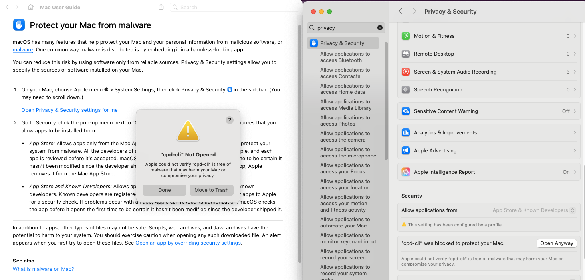
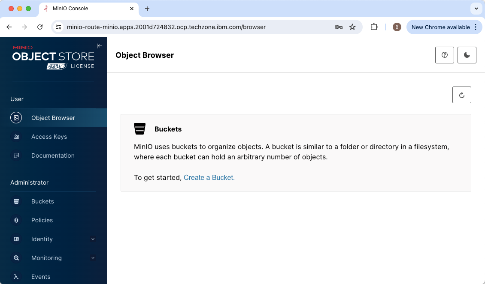
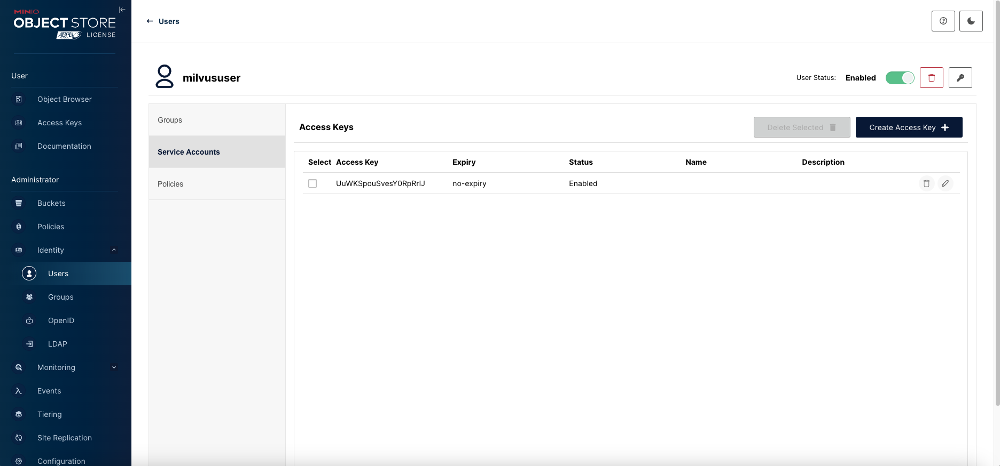
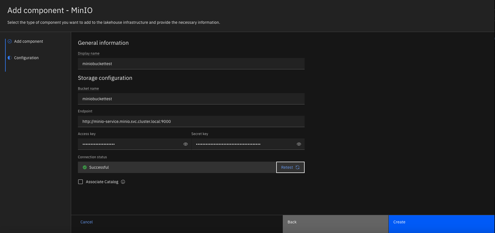
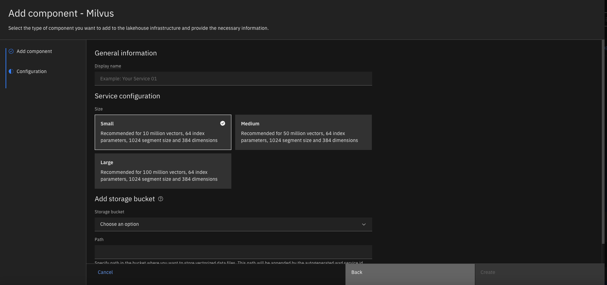
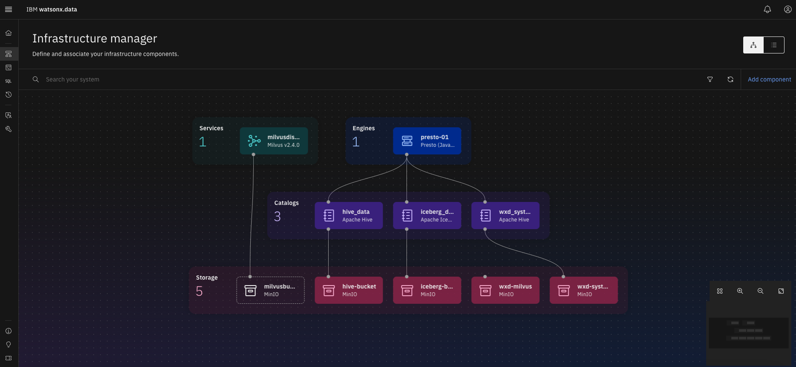

# How to Install IBM watsonx.data and Milvus

IBM watsonx.data, which is part of the IBM watsonx platform, is a data store that helps businesses scale AI and analytics. It is built on an open lakehouse architecture that combines elements of data warehouses and data lakes. It supports open data formats and includes built-in governance, security, and automation. 

IBM watsonx.data supports Milvus natively among other capabilities. Milvus is an open-source vector database that stores, indexes, and manages large embedding vectors generated by machine learning (ML) models and deep neural networks.

This document outlines the steps to install watsonx.data and Milvus. For more details, check:
- [Installing watsonx.data](https://www.ibm.com/docs/en/watsonx/watsonxdata/2.0.x?topic=deployment-installing)
- [Adding a Milvus service](https://www.ibm.com/docs/en/watsonx/watsonxdata/2.0.x?topic=milvus-adding-service)

## Install watsonx.data

Download the latest version of Cloud Pak for Data [CPD-CLI](https://github.com/IBM/cpd-cli/releases) command. 

MacBook users can work around security restrictions by trusting several components of the tool. Check the details [here](https://www.ibm.com/docs/en/cloud-paks/cp-data/5.0.x?topic=cli-installing-cpd). On Sequoia or newer version, right click and open the "cpd-cli" command in the unzipped folder. Click on the question mark and then click on "Open Privacy & Security settings for me". Then click on the "Open Anyway" button next to "cpd-cli was blocked to protect your mac. Repeating the step for other components.



Review and modify the environment variables. When installing watsonx.data on an existing CP4D environment, e.g. watsonx.ai, check the CP4D version first. Run the commands one by one and fix issues before continuing to the next command. Most commands finish quickly but the `manage apply-cr` command takes more than one hour.

```
# oc login --token=xxx --server=https://xxx

export OCP_TOKEN=xxx
export OCP_URL=https://xxx
export VERSION=5.0.2
export PROJECT_CERT_MANAGER=cert-manager
export PROJECT_LICENSE_SERVICE=licensing-manager
export PROJECT_CPD_INST_OPERANDS=ibm-cpd
export PROJECT_CPD_INST_OPERATORS=ibm-operators
export STG_CLASS_BLOCK=ocs-external-storagecluster-cephfs
export STG_CLASS_FILE=ocs-external-storagecluster-cephfs
export COMPONENTS=cpd_platform,watsonx_data

./cpd-cli manage login-to-ocp  --server=${OCP_URL}  --token=${OCP_TOKEN}

# check CP4D version
./cpd-cli manage get-cr-status  --cpd_instance_ns=${PROJECT_CPD_INST_OPERANDS}

# certificate manager and the license service
./cpd-cli manage apply-cluster-components  --release=${VERSION}  --license_acceptance=true  --cert_manager_ns=${PROJECT_CERT_MANAGER}  --licensing_ns=${PROJECT_LICENSE_SERVICE}

# permissions
./cpd-cli manage authorize-instance-topology  --cpd_operator_ns=${PROJECT_CPD_INST_OPERATORS}  --cpd_instance_ns=${PROJECT_CPD_INST_OPERANDS}

# topology
./cpd-cli manage setup-instance-topology  --release=${VERSION}  --cpd_operator_ns=${PROJECT_CPD_INST_OPERATORS}  --cpd_instance_ns=${PROJECT_CPD_INST_OPERANDS}  --license_acceptance=true  --block_storage_class=${STG_CLASS_BLOCK}

# cp4d operator
./cpd-cli manage apply-olm  --release=${VERSION}  --cpd_operator_ns=${PROJECT_CPD_INST_OPERATORS}  --components=${COMPONENTS}

# cp4d operand
./cpd-cli manage apply-cr --release=${VERSION}  --cpd_instance_ns=${PROJECT_CPD_INST_OPERANDS}  --components=${COMPONENTS}  --block_storage_class=${STG_CLASS_BLOCK}  --file_storage_class=${STG_CLASS_FILE}  --license_acceptance=true

# entitlement. You may skip production and preview options
./cpd-cli manage apply-entitlement  --cpd_instance_ns=${PROJECT_CPD_INST_OPERANDS}  --entitlement=watsonx-data

```

## Adding storage for Milvus

Before adding a Milvus service, you must create and configure storage first. You can use any of the following storage services that watsonx.data supports. We will go over three of them marked with `*`. 
- IBM Cloud Object Storage *
- IBM Storage Ceph
- IBM Storage Scale
- Amazon S3 *
- Google Cloud Storage
- HDFS
- MinIO *
- Azure Data Lake Storage

### Using an external minio storage

First, create a minio storage in the same OpenShift cluster. Ensure that you have downloaded the three yaml files, `kustomization.yml`,`minio.yml`,`pvc.yml`, and save them to the minio folder. Navigate to the parent folder and run the command lines below to create the Minio storage in its own namespace, `minio`, which is created automatically. 

Check more details on [how to install minio](https://min.io/docs/minio/kubernetes/openshift/operations/installation.html)

```
#oc new-project minio
#cd ..
oc apply -k minio
```

Navigate to the networking services for the Minio storage, and make a note of the hostname, e.g. "minio-service.minio.svc.cluster.local". Note: the `oc describe service minio-service -n minio` does not include the hostname.

> ![IMPORTANT] 
> You will use the hostname plus the port number e.g. 9000 as the endpoint, not the url you find in networking routes, when configuring storage in watsonx.data.

You can find the url from the networking routes, e.g. `https://minio-route-minio.apps.xxx.com`,  and login with the default credentials, with username `minio123` and password `minio123`



Create a new bucket, a new user and its service account and grant the user with read/write access permissions. By default, the bucket's access policy is set to be Private. Make a note of the access key and secret key.



Now you are ready to use the minio storage for Milvus. 

Log in to the cp4d platform. Locate the lakehouse instance in Services | Instances. Launch the watsonx.data web console. Note: you can find the cpadmin credentails in the "ibm-iam-bindinfo-platform-auth-idp-credentials" secret in the cp4d namespace in OpenShift.

Select Infrastructure Manager from the navigation menu on the left side. Click on "Add components" and select "MinIO" in the storage category. Fill the following fields, and then test the connection.

- Display name, e.g. mymilvus
- Bucket name, e.g. miniobucket
- Endpoint, e.g.  http://minio-service.minio.svc.cluster.local:9000
- Access key
- Secret key




### using IBM Cloud Object Storage

### using Amazon AWS S3 storage

### using the embedded minio storage

## Adding a Milvus service

Select Infrastructure Manager from the navigation menu on the left side. Click on "Add components" and select "Minio" in the Services category.



Once the storage and Milvus service configurations are completed, you'll see a visual representation.

