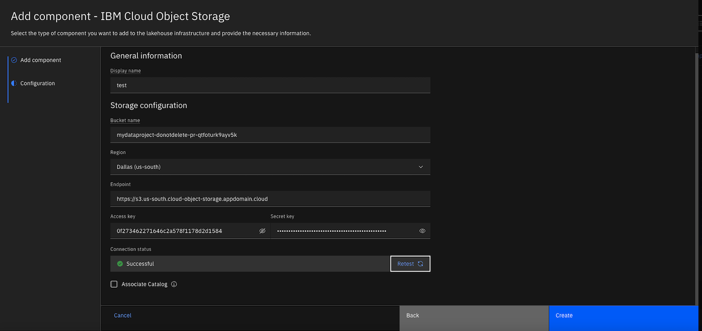
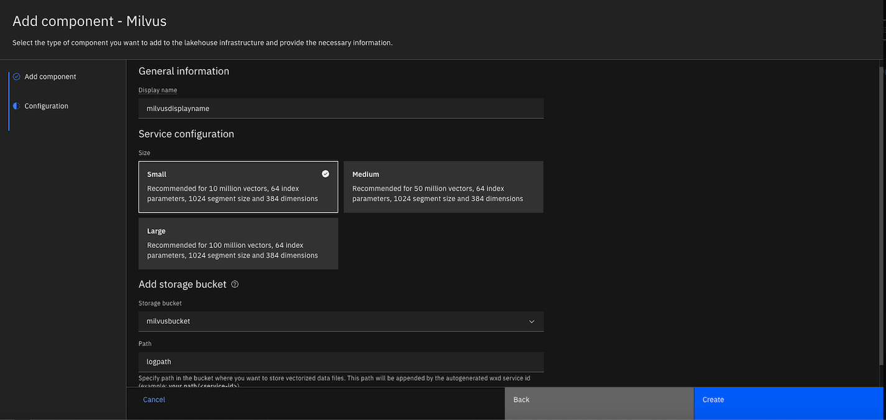
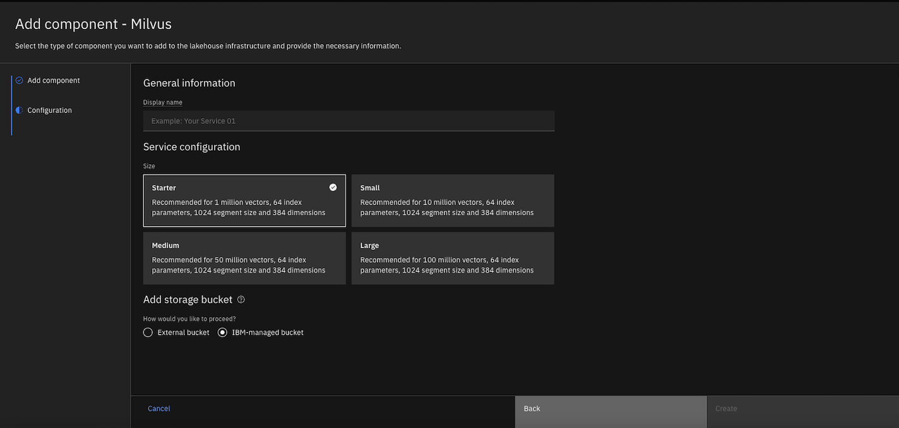

# How to Install and Configure IBM watsonx.data and Milvus

IBM watsonx.data, which is part of the IBM watsonx platform, is a data store that helps businesses scale AI and analytics. It is built on an open lakehouse architecture that combines elements of data warehouses and data lakes. It supports open data formats and includes built-in governance, security, and automation. 

IBM watsonx.data supports Milvus natively among other capabilities. Milvus is an open-source vector database that stores, indexes, and manages large embedding vectors generated by machine learning (ML) models and deep neural networks.

This document outlines the steps to install watsonx.data and Milvus. For more details, check:
- [Installing watsonx.data](https://www.ibm.com/docs/en/watsonx/watsonxdata/2.0.x?topic=deployment-installing)
- [Adding a Milvus service](https://www.ibm.com/docs/en/watsonx/watsonxdata/2.0.x?topic=milvus-adding-service)

## Installing watsonx.data

Download the latest version of Cloud Pak for Data [CPD-CLI](https://github.com/IBM/cpd-cli/releases) command. 

MacBook users can work around security restrictions by trusting several components of the tool. Check the details [here](https://www.ibm.com/docs/en/cloud-paks/cp-data/5.0.x?topic=cli-installing-cpd). On Sequoia or newer version, right click and open the "cpd-cli" command in the unzipped folder. Click on the question mark and then click on "Open Privacy & Security settings for me". Then click on the "Open Anyway" button next to "cpd-cli was blocked to protect your mac. Repeating the step for other components.


Review and modify the environment variables. When installing watsonx.data on an existing CP4D environment, e.g. watsonx.ai, check the CP4D version first. Run the commands one by one and fix issues before continuing to the next command. Most commands finish quickly but the `manage apply-cr` command takes more than one hour.

```
# oc login --token=xxx --server=https://xxx

export OCP_TOKEN=xxx
export OCP_URL=https://xxx
export VERSION=5.0.2
export PROJECT_CERT_MANAGER=cert-manager
export PROJECT_LICENSE_SERVICE=licensing-manager
export PROJECT_CPD_INST_OPERANDS=ibm-cpd
export PROJECT_CPD_INST_OPERATORS=ibm-operators
export STG_CLASS_BLOCK=ocs-external-storagecluster-cephfs
export STG_CLASS_FILE=ocs-external-storagecluster-cephfs
export COMPONENTS=cpd_platform,watsonx_data

./cpd-cli manage login-to-ocp  --server=${OCP_URL}  --token=${OCP_TOKEN}

# check CP4D version
./cpd-cli manage get-cr-status  --cpd_instance_ns=${PROJECT_CPD_INST_OPERANDS}

# certificate manager and the license service
./cpd-cli manage apply-cluster-components  --release=${VERSION}  --license_acceptance=true  --cert_manager_ns=${PROJECT_CERT_MANAGER}  --licensing_ns=${PROJECT_LICENSE_SERVICE}

# permissions
./cpd-cli manage authorize-instance-topology  --cpd_operator_ns=${PROJECT_CPD_INST_OPERATORS}  --cpd_instance_ns=${PROJECT_CPD_INST_OPERANDS}

# topology
./cpd-cli manage setup-instance-topology  --release=${VERSION}  --cpd_operator_ns=${PROJECT_CPD_INST_OPERATORS}  --cpd_instance_ns=${PROJECT_CPD_INST_OPERANDS}  --license_acceptance=true  --block_storage_class=${STG_CLASS_BLOCK}

# cp4d operator
./cpd-cli manage apply-olm  --release=${VERSION}  --cpd_operator_ns=${PROJECT_CPD_INST_OPERATORS}  --components=${COMPONENTS}

# cp4d operand
./cpd-cli manage apply-cr --release=${VERSION}  --cpd_instance_ns=${PROJECT_CPD_INST_OPERANDS}  --components=${COMPONENTS}  --block_storage_class=${STG_CLASS_BLOCK}  --file_storage_class=${STG_CLASS_FILE}  --license_acceptance=true

# entitlement. You may skip production and preview options
./cpd-cli manage apply-entitlement  --cpd_instance_ns=${PROJECT_CPD_INST_OPERANDS}  --entitlement=watsonx-data

```

## Adding storage for Milvus

Before adding a Milvus service, you must create and configure storage first. You can use any of the following storage services that watsonx.data supports. We will go over three of them marked with `*`. 
- IBM Cloud Object Storage *
- IBM Storage Ceph
- IBM Storage Scale
- Amazon S3 *
- Google Cloud Storage
- HDFS
- MinIO *
- Azure Data Lake Storage

### Using an external minio storage

First, create a minio storage in the same OpenShift cluster. Ensure that you have downloaded the three yaml files, `kustomization.yml`,`minio.yml`,`pvc.yml`, and save them to the minio folder. Navigate to the parent folder and run the command lines below to create the Minio storage in its own namespace, `minio`, which is created automatically. 

Check more details on [how to install minio](https://min.io/docs/minio/kubernetes/openshift/operations/installation.html)

```
#oc new-project minio
#cd ..
oc apply -k minio
```

Navigate to the networking services for the Minio storage, and make a note of the hostname, e.g. "minio-service.minio.svc.cluster.local", and the api port number. Note: the `oc describe service minio-service -n minio` does not include the hostname.

> [!IMPORTANT] 
> You will use the hostname plus the port number e.g. 9000 as the endpoint, not the url you find in networking routes, when configuring storage in watsonx.data.

You can find the url from the networking routes, e.g. `https://minio-route-minio.apps.xxx.com`,  and login with the default credentials, with username `minio123` and password `minio123`


Create a new bucket, a new user and its service account and grant the user with read/write access permissions. By default, the bucket's access policy is set to be Private. Make a note of the access key and secret key.


Now you are ready to use the minio storage for Milvus. 

Log in to the cp4d platform. Locate the lakehouse instance in Services | Instances. Launch the watsonx.data web console. Note: you can find the cpadmin credentails in the "ibm-iam-bindinfo-platform-auth-idp-credentials" secret in the cp4d namespace in OpenShift.

Select Infrastructure Manager from the navigation menu on the left side. Click on "Add components" and select "MinIO" in the storage category. Fill the following fields, and then test the connection.

- Display name, e.g. miniostorage
- Bucket name, e.g. miniobucket
- Endpoint, e.g.  http://minio-service.minio.svc.cluster.local:9000
- Access key
- Secret key


### Using IBM Cloud Object Storage

Log in to your ibm cloud account, find an existing storage instance or create a new one. Select the "Service credentials" tab and create a new credential. Make sure that you enable the HMAC option. Make a note of the access key and the secret access key in the json file. Note: this new credential has access to all buckets in the storage instance.

```
{
    "apikey": "b0EUeb7wARLTbUQUpJ5M...",
    "cos_hmac_keys": {
        "access_key_id": "0f2734622...",
        "secret_access_key": "d1b6de4f863e85cac..."
    },
    "endpoints": "https://control.cloud-object-storage.cloud.ibm.com/v2/endpoints",
    "iam_apikey_description": "Auto-generated for key crn:v1:bluemix:public:cloud-object-storage:global:a/67c595908...",
    "iam_apikey_id": "ApiKey-68d942dd-...",
    "iam_apikey_name": "milvusnewcr",
    "iam_role_crn": "crn:v1:bluemix:public:iam::::serviceRole:Manager",
    "iam_serviceid_crn": "crn:v1:bluemix:public:iam-identity::a/67c5959...::serviceid:ServiceId-075e670b-...",
    "resource_instance_id": "crn:v1:bluemix:public:cloud-object-storage:global:a/67c5959082db4698b82cb36...::"
}
```


Use the existing bucket or create a new bucket. Select the Configuration tab. Make a note of the public endpoint, e.g. "s3.us-south.cloud-object-storage.appdomain.cloud".

Similar to the MinIO storage option, you can create a storage for Milvus using IBM Cloud Object Storage. Make sure that the region matches the public endpoint.



### Using Amazon AWS S3 storage

You can use an existing or create a new S3 bucket in your Amazon AWS account, and then configure the storage for Milvus. Make sure that the region matches the public endpoint, which is available at [Amazon S3 endpoints](https://docs.aws.amazon.com/general/latest/gr/s3.html).


## Adding a Milvus service

Select Infrastructure Manager from the navigation menu on the left side. Click on "Add components" and select "Milvus" in the Services category.

Fill the fields and create the Milvus service.

- Display name, e.g. Milvus
- Service configuration: small, medium, or large
- Storage: choose the storage you configured
- Path: any valid name for Milvus data and logs



> [!NOTE] 
> The Starter service configuration is no longer available. However, for some CP4D/watsonx.data versions, you may be able to see the Starter configuration for Milvus. With this option, you can choose to use an external storage, or an IBM managed storage, or the embedded MinIO store named wxd-milvus-minio. 



Once the storage and Milvus service configurations are completed, you'll see a visual representation. It takes 15 minutes or so until the Milvus service is ready to use and its icon changes to the green color.


Click on the service, you will see the GRPC host, which can be used in python code and HTTPs host for restful API calls.

```
GRPC host
ibm-lh-lakehouse-milvus743.milvus.apps.xxx.com

HTTPS host
https://ibm-lh-lakehouse-milvus743-milvus-rest-ibm-wx-operands.apps.xxx.com

Associated bucket
milvusbucket

Path
/logpath/milvus743/
```

## Connecting to the Milvus service in Python code

The code snippets demonstrate how to connect to the service. In addition to the admin or user credentials, you will need the GPRC host name and port, and the certificate. 

You can find the certificate by running the [command lines](https://docs.openshift.com/container-platform/4.15/nodes/pods/nodes-pods-secrets.html) below. 

```
oc login --token=sha256~y177r3dxxx --server=https://api.xxx.com:6443
oc get secret ibm-lh-tls-secret -n ibm-wx-operands -o jsonpath="{.data['tls\.crt']}" | base64 -d > milvus.tls.crt
```

Or, you can find it in the secret named "ibm-lh-tls-secret" in the cp4d namespace in OpenShift. Save it to a text file, e.g. "milvus.tls.crt". 

```
# pip install pymilvus==2.5.0

from pymilvus import MilvusClient, DataType, connections

_URI = f"https://ibm-lh-lakehouse-milvus743.milvus.apps.xxx.com:443"  # Construct URI from host and port
_SERVERNAME="ibm-lh-lakehouse-milvus743.milvus.apps.xxx.com"

# Create an instance of the MilvusClient class with the new configuration
milvus_client = MilvusClient(uri=_URI, 
                            user='cpadmin', password='xxx',
                            secure=True,
                            server_name=_SERVERNAME,
                            server_pem_path="milvus.tls.crt")
```

With the connection, you can create collections, insert data, create indexes, and perform searches.  Check out the sample [Milvus notebook](/scripts/milvus.ipynb).

## Troubleshooting deployment and configuration issues

During watsonx.data deployment, you may encounter errors when running the `cpd-cli` commands listed in the "Installing watsonx.data" section. As a first troubleshooting attempt, you can re-run the same command to see if the issue is taken care of.

### CP4D versions mismatched

It is important that you check the CP4D version when adding watsonx.data to an existing environment.  

```
# check CP4D version
./cpd-cli manage get-cr-status  --cpd_instance_ns=${PROJECT_CPD_INST_OPERANDS}
```

If an incorrect version is used, you may get an error that looks similar to the following. Correct the CP4D version and run the commands.

```
fatal: [localhost]: FAILED! => {"changed": false, "msg": "[ERROR] Playbook failed while running 'wait_for_cr.yml' of 'wxdaddon' for component 'watsonx_data' in namespace 'ibm-cpd'. The custom resources for the following components are already updated for the ['cpd_platform', 'watsonx_data'] release 5.0.3."}
```

### Insufficient CPU and Memory

When deploying watsonx.data to a new or existing OpenShift environment, you may find some pods, e.g. the lakehouse presto pod, are crashed, due to insufficient CPU and Memory. You may see some error details in the pod Events. Add more computing resources and re-run the commands.

```
0/11 nodes are available: 3 node(s) had untolerated taint {node-role.kubernetes.io/master: }, 3 node(s) had untolerated taint {node.ocs.openshift.io/storage: true}, 4 Insufficient memory, 5 Insufficient cpu. preemption: 0/11 nodes are available: 5 No preemption victims found for incoming pod, 6 Preemption is not helpful for scheduling.
```

### Operators are in unknown state

You may notice that one or more operators are not installed correctly. Delete the problematic operators and re-run the command. If necessary, re-run all the commands.

- analyticsengine-operator	
- ibm-lakehouse-operator	

### Connection to storage failed in Infrastructure Manager

Check the bucket name, region if applicable, access key, secret key and endpoint. For example, with MinIO storage, use the local url with the port number, instead of the public https url. Ensure the region matches the endpoint for storage services.

### Certificate issue

You may get a handshake failure shortly after the connection is made successfully. This is likely caused by an invalid certificate used in a previous connection attempt. Restart the python kernel and re-run the python code.

```
E1206 10:13:18.832863000 13103345664 ssl_transport_security.cc:1653]   Handshake failed with fatal error SSL_ERROR_SSL: error:1000007d:SSL routines:OPENSSL_internal:CERTIFICATE_VERIFY_FAILED.
```

## Acknowledgement

Many thanks to my IBMer, Nischay Yadav who helped me unblock several issues related to storage and Milvus configurations, and shared sample python code for testing. Also, thanks to my teammate, Brandon Brown who provided his s3 storage for testing.